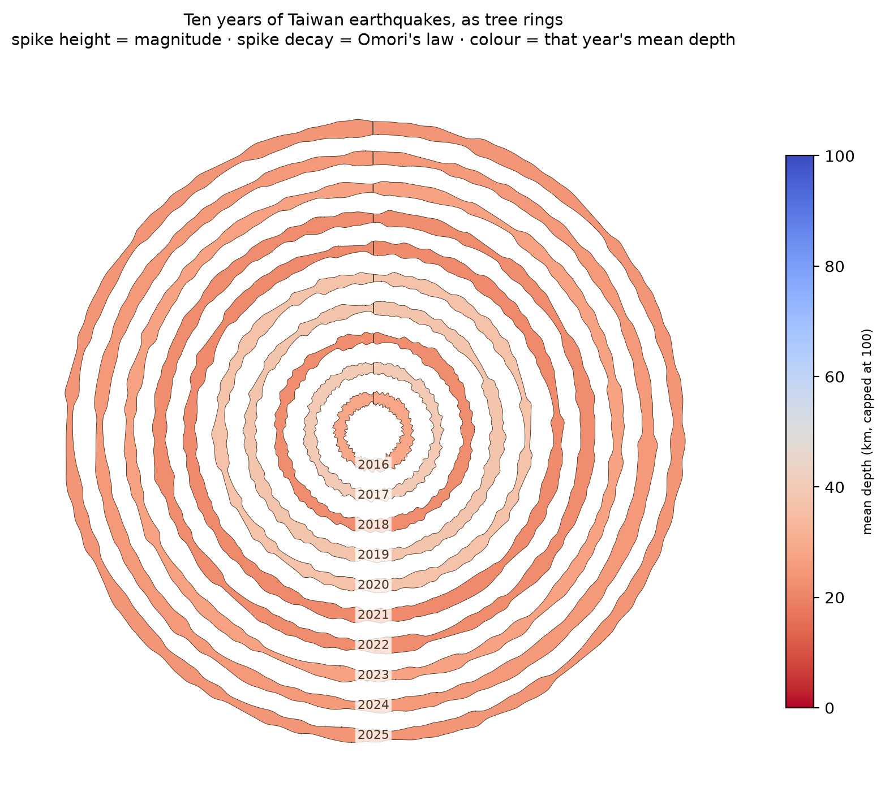

# Ten years of Taiwan earthquakes, as tree rings

## The phenomenon

Taiwan sits where the Philippine Sea Plate slides under the Eurasian Plate. The ground there moves every day, and the USGS records every earthquake above magnitude 3.5 in a public file. I looked at ten years of that file — 2016 to 2025 — because I wanted to see whether a year with one big earthquake looks different from a year with many small ones. The picture turns each year into a tree ring: a year with a big earthquake makes a tall spike, and the spike decays the way real aftershock sequences decay.

## The source

The file is `data/quakes-taiwan-2016-01-01-to-2025-12-31.geojson`, fetched once from the USGS Earthquake Hazards Program:

<https://earthquake.usgs.gov/fdsnws/event/1/query?format=geojson&starttime=2016-01-01&endtime=2025-12-31&minmagnitude=3.5&minlatitude=21.0&maxlatitude=26.0&minlongitude=119.0&maxlongitude=123.0>

It holds 1,765 earthquakes, each one a point with a magnitude (a number, no units), a depth in kilometres, a longitude, a latitude and a time. `fetch.py` writes the raw reply unchanged into `data/`. `explore.py` reads it and writes two trimmed CSVs into `out/`: one row per year, and one row per earthquake. `plot.py` reads only those CSVs.

## What the picture shows

Each ring is one year, 2016 innermost and 2025 outermost. The height of a bump is that earthquake's magnitude, and the long tail after each bump follows Omori's law — the same shape real aftershock sequences have. Colour is that year's mean depth, warm for shallow and cool for deep.

What it hides: the position of every earthquake is thrown away. Two earthquakes with the same magnitude and depth look identical on the ring, even if one happened under Hualien and the other under Yujing. The picture answers "when and how strong", not "where". It also caps depth colour at 100 km, so anything deeper looks the same as 100 km.

## Run it
