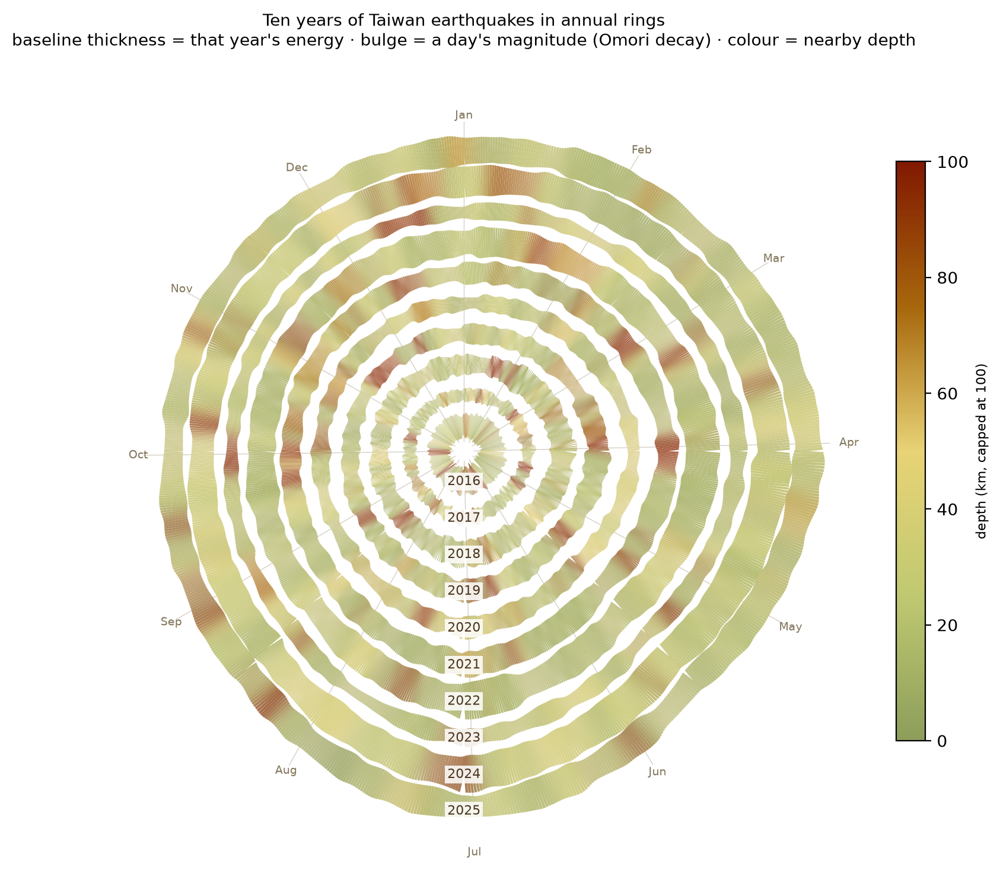

## Live page

<https://laiziyuzhou4288-creator.github.io/Ten-years-of-Taiwan-earthquakes-in-annual-rings/>

# Ten years of Taiwan earthquakes in annual rings

## The phenomenon

Taiwan sits where the Philippine Sea Plate slides under the Eurasian Plate. The ground there moves every day, and the USGS records every earthquake above magnitude 3.5 in a public file. I looked at ten years of that file — 2016 to 2025 — because I wanted to see whether a year with one big earthquake looks different from a year with many small ones. The earthquake conditions of each year are visualized as a circle of annual rings, and the size and depth of the earthquake can be judged by the protrusions and colors

## The source

The file is `data/quakes-taiwan-2016-01-01-to-2025-12-31.geojson`, fetched once from the USGS Earthquake Hazards Program:

<https://earthquake.usgs.gov/fdsnws/event/1/query?format=geojson&starttime=2016-01-01&endtime=2025-12-31&minmagnitude=3.5&minlatitude=21.0&maxlatitude=26.0&minlongitude=119.0&maxlongitude=123.0>

It holds 1,765 earthquakes, each one a point with a magnitude (a number, no units), a depth in kilometres, a longitude, a latitude and a time. `fetch.py` writes the raw reply unchanged into `data/`. `explore.py` reads it and writes two trimmed CSVs into `out/`: one row per year, and one row per earthquake. `plot.py` reads only those CSVs.

## What the picture shows

Each ring represents one year, 2016 innermost and 2025 outermost. Three things carry information at once:

- the **shape** of the ring — a spike on the day of an earthquake, its height set by magnitude, its long tail following Omori's law, the way real
  aftershock sequences decay
- the **width** of the ring — that year's total seismic energy, so a busy year sits visibly thicker even between its spikes
- the **colour** of the ring — I chose red to represents a shallow earthquake (close to the surface), green to represents a deep one, and pale cream represents no earthquake that day. Shallower earthquakes have a greater destructive effect on the surface. This design not only conforms to people's common sense about the color of safety and warning signals, but also makes powerful earthquakes visually appear to have caused more severe wounds to the growth rings.

## Run it
